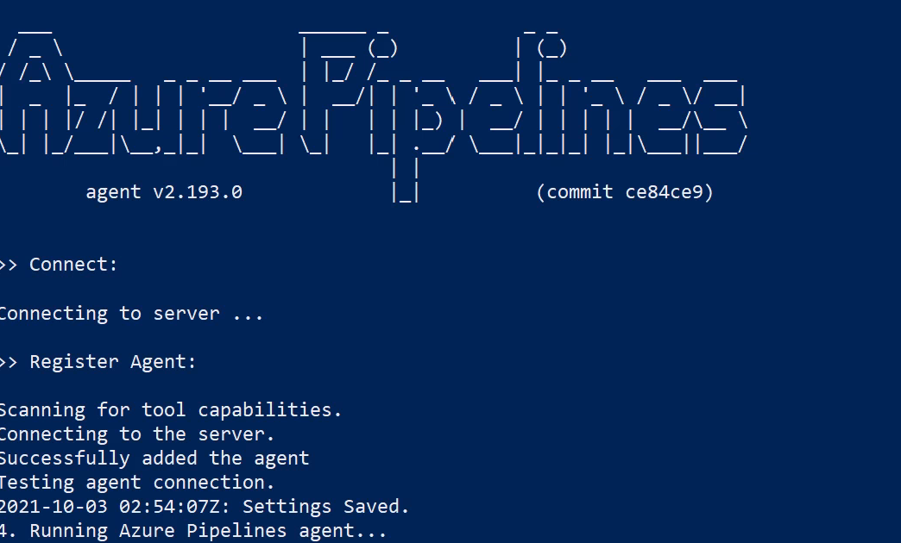
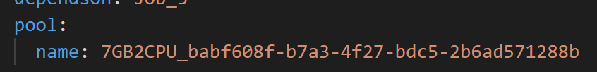
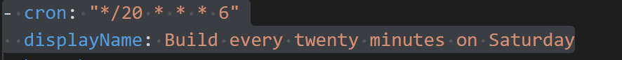
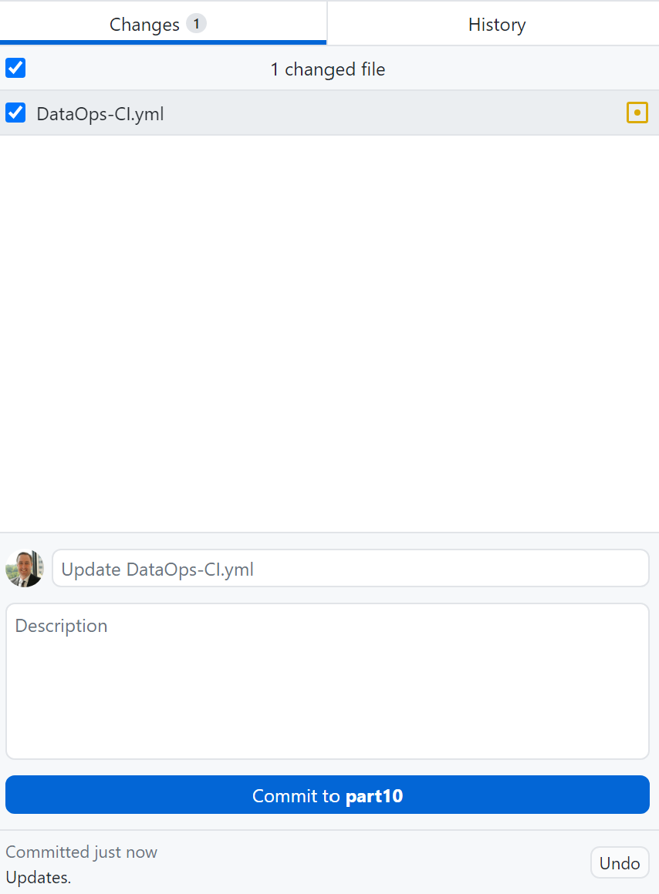
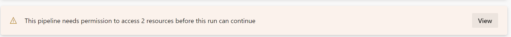
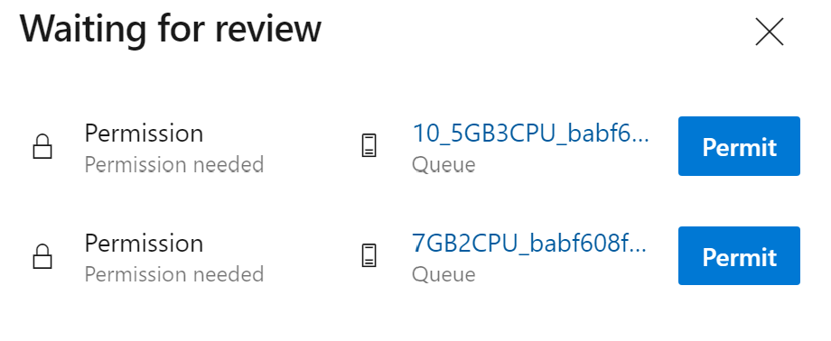
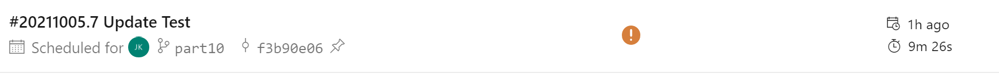

# Part 10 of "Bringing DataOps to Power BI" this branch serves to provides templates for applying DataOps principles.

These instructions are a continuation from <a href="https://www.kerski.tech/bringing-dataops-to-power-bi-part10/" target="_blank">Part 10 of Bringing DataOps to Power BI</a>.  The steps below describe how to setup the testing of script performance (time to complete) between Microsoft hosted and self-hosted containers.

> ***Important Note #1**: This guide is customized to Power BI for U.S. Commercial environment. If you are trying to set this up for another Microsoft cloud environment (like U.S. Gov Cloud), please check Microsoft's documentation for the appropriate URLs. They will be different from the U.S. Commercial environment.*

> ***Important Note #2**: This guide uses scripts that I built and tested on environments I have access to. Please review all scripts if you plan for production use, as you are ultimately response for the code that runs in your environment.*

## Table of Contents

1. [Prerequisites](#Prerequisites)
1. [Installation Steps](#Installation-Steps)
1. [Setting Up The Tests](#Setting-Up-The-Tests)

## Prerequisites

### Power BI
-   Power BI Premium Per User license assigned to a service account. If you do not have a Premium Per User license, use the "Buy Now" feature on <a href="https://docs.microsoft.com/en-us/power-bi/admin/service-premium-per-user-faq" target="_blank">Microsoft's site</a> or if you don't have access to do that, please contact your administrator (be nice!).

### Desktop

-  <a href="https://docs.microsoft.com/en-us/cli/azure/install-azure-cli" target="_blank">Azure CLI</a> installed.

-  <a href="https://docs.microsoft.com/en-us/powershell/scripting/install/installing-powershell?view=powershell-5.1" target="_blank">PowerShell 5.1</a> installed.  If you are using Windows 10 or 11, this should be installed already. For the purposes of the instructions I'm going to use PowerShell ISE to run a PowerShell script. 

-   <a href="https://desktop.github.com/" target="_blank">GitHub desktop</a> installed.

-   Power BI Desktop installed on device executing these steps.

-  <a href="https://docs.docker.com/desktop/windows/install/">Docker</a> installed.  I won't lie hear, this was a pain for Windows, but <a href="https://docs.microsoft.com/en-us/virtualization/windowscontainers/quick-start/set-up-environment?tabs=Windows-Server">this link</a> helped as well.

### Azure DevOps

-  Signed up for <a href="https://docs.microsoft.com/en-us/azure/devops/user-guide/sign-up-invite-teammates?view=azure-devops" target="_blank">Azure DevOps</a>.

- For Azure DevOps you must be a member of the Project Collection Administrators group or the Organization Owner.

- A Personal Access Token with Full Access permissions. Instructions can be accessed at <a href="https://docs.microsoft.com/en-us/azure/devops/organizations/accounts/use-personal-access-tokens-to-authenticate?view=azure-devops&tabs=preview-page#create-a-pat">this link</a>. Be sure to copy the token because you will use it later.

### SharePoint Online

- For SharePoint Online you must have administrator rights in order for the SharePoint site and Low-Code Coverage list to be created.

## Installation Steps

### Create Power BI Workspaces, Create Azure DevOps project, and SharePoint Online site for logging low-code coverage data
1. Open PowerShell ISE and enter the following script:
    > Invoke-WebRequest -Uri "https://raw.githubusercontent.com/kerski/pbi-dataops-template/part10/SetupScripts/PremiumPerUser/Setup-PPU.ps1" -OutFile "./Setup-PPU.ps1"

1. Highlight the code and select "Run Selection" (outlined in orange in the image below).

    

1. This will download the setup script to the current folder.  Open the file "Setup-PPU.ps1" in PowerShell ISE.

1. Highlight the code and select "Run Selection" (outlined in orange in the image below).

    

1. During the install process you will be prompted to enter the following information:

    - The name of the build workspace you wish to create in the Power BI Service.
    - The name of the development workspace you wish to create in the Power BI Service.
    - The name (UPN/email) of the Service account you created in the Prerequisites section.
    - The password for the (UPN/email). ***Important Note**: This scripts assumes PowerShell Version 5.1, so this password WILL NOT be masked. Make sure to protect this password from someone snooping behind you.* 
    - The name of the project you wish to create in Azure DevOps.
    - The base URL for the SharePoint Online site (do not end with a forward slash).
    - The name of the SharePoint site you wish to create. 

    

1. During the course of the install you will be prompted to enter your Microsoft 365 credentials. Depending on your environment you may have a browser tab appear to sign-in. After signing in you can return to the PowerShell ISE window. In addition, if you don't have the Power BI Management Shell or Azure DevOps CLI package installed, you will be asked to install.  Please affirm you wish to install those packages if prompted.

    

1. If the script runs successfully you will be presented with a message similar in the image below. 

    

### Create Agent Pools and Containers

1. Open PowerShell ISE and enter the followinging script:
    > Invoke-WebRequest -Uri "https://raw.githubusercontent.com/kerski/pbi-dataops-template/part10/SetupScripts/Containers/Setup-Container.ps1" -OutFile "./Setup-Container.ps1"

1. This will download the setup script to the current folder.  Open the file "Setup-Container.ps1" in PowerShell ISE.

1. Highlight the code and select "Run Selection" (outlined in orange in the image below).

    

1. During the course of the install you will be prompted to enter your Microsoft 365 credentials. Depending on your environment you may have a browser tab appear to sign-in. After signing in you can return to the PowerShell ISE window.. Moreover, you will also be prompted to enter the following information:

    - The name of the subscription in Azure.
    - The URL of the Azure DevOps instance (ex. https://dev.azure.com/org)
    - The Personal Access Token created during the [Prerequisites](#Prerequisites)

1. During the last steps of the install process the containers will install all the modules and libraries.  To check on that status you will need to open a separate PowerShell window and run these commands:

    - az container attach --resource-group rg-pbi-dataops --name container-pbi-dataops-10-5gb-3cpu
    -az container attach --resource-group rg-pbi-dataops --name container-pbi-dataops-7gb-2cpu

1. If you see image below for both containers, the containers will be ready for the next steps.

    

1. In addition, if the Setup-Container.ps1 script runs successfully you will be presented with a message similar in the image below.  Please be sure to save the two pool names, because you will use those later. 

    

## Priming the Pipeline

As stated in <a href="https://www.kerski.tech/bringing-dataops-to-power-bi-part5/" target="_blank">Part 5 of Bringing DataOps to Power BI</a> the data source credentials have to be manually set in order for the pipeline to be automated.  This is based on Power BI's architecture as of August 2021.  Please take the following steps to setup the credentials for the SampleModel.pbix file found within this project.

1. Navigate to <a href="https://app.powerbi.com" target="_blank">app.powerbi.com</a> and go the workspace you named in step 5 on the [Installation Steps](#InstallationSteps). Find the dataset and select the 'Settings' option (example outlined in orange in the image below).

    

1. Expand the 'Data source credentials' section and select 'Edit Credentials' link (outlined in orange in the image below).
    

1. Select the Authentication method as "Anonymous" and Privacy level to "None" and then press the "Sign in" button.

    

## Setting Up The Tests

With the [Installation Steps](#InstallationSteps) and [Priming the Pipeline](#PrimingthePipeline) steps complete, you will need to follow the steps below to work with the project locally, make a change to the DataOps-CI.yml, commit it to the repository in Azure DevOps, and run the tests in the pipeline in order to collect performance data.

1. Copy the URL and navigate the project in Azure DevOps. Click on the Repos section and select the Clone button (outlined in orange in the image below).

 

2.  Copy the textbox under the 'Command line' label. I suggest copying to Notepad temporarily as you'll have two other text fields to copy (outlined in orange in the image below).

 

3. Press the "Generate Git Credentials" button.

 

4. Copy the Username and Password to Notepad temporarily.

5. Open GitHub Desktop and select clone repository (outlined in orange in the image below).

6. Paste the URL copied in step 2.

 

7. You will then be prompted to enter the username and password credentials you copied in Step 4.

 

8. Within GitHub Desktop switch the branch from main to 'origin/part10'.  I ask you to do this because in subsequent blog series, I'll have separate branches that will introduce new features that follow DataOps principles.

9. With File Explorer (for Windows) navigate to the DataOps-CI.yml file, and update the agent pools names prefixed with "7GB2CPU" and "10_5GB3CPU" with the agent pools that were created during the Setup-Container.ps1 script process.

10. On lines 2-3 of the DataOps-CI.yml also update the cron section to run every 20 minutes on the current day.  That way you get enough data to see if performance has improved. In the example below this job runs every 20 minutes on a Saturday (6).

11. Navigate back to GitHub Desktop and press "Commit to part10" (outlined in orange in the image below).

12. Then select the "Push origin" button.  This will push the changes to Azure DevOps and kick off the pipeline.

13. Navigate back to Azure DevOps and you should see the pipeline in progress.  

14. You will be presented with approval to allow the hosted containers to access this pipeline.  Please approve.

15. The pipeline will now run automatically every twenty minutes on the day you changed in step 10.  When complete you should see an exclamation point saying a run succeeded with issues.  This is due to the Best Practice Analyzer finding some warnings. 

16. Be sure to check the jobs from time to time.  If the builds succeed with issues more than they fail, you're in good shape.
When finished you can delete the resource group in Azure so you don't incur more costs than necessary.  