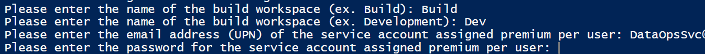
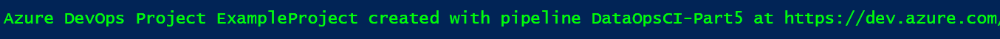
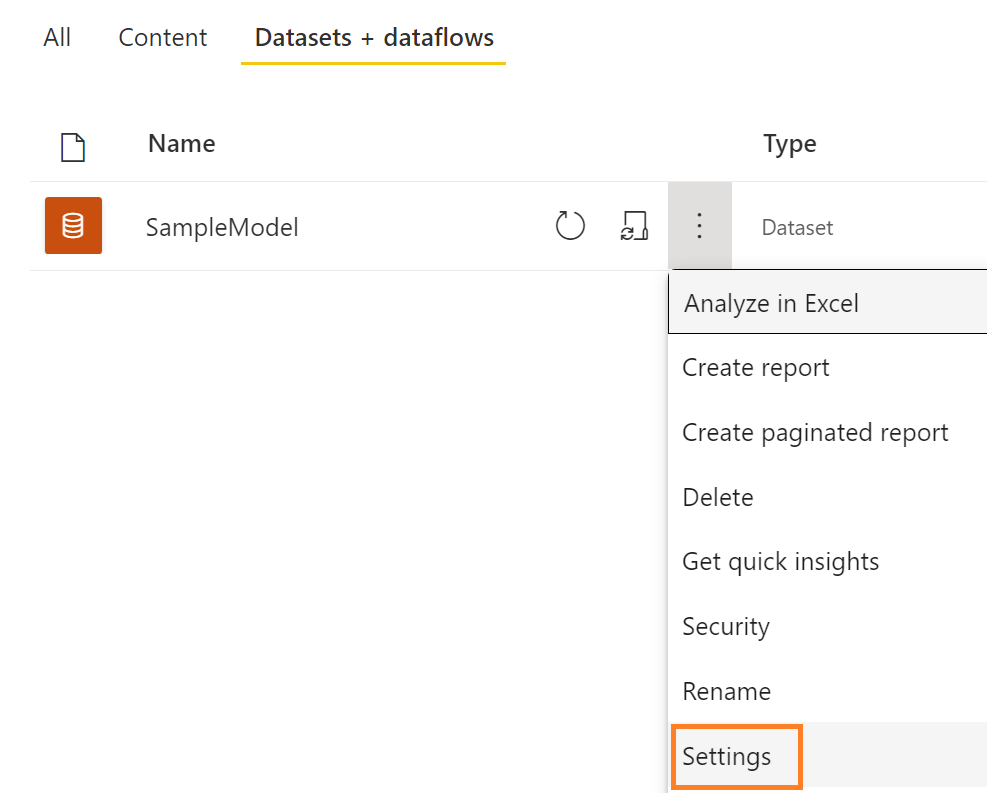
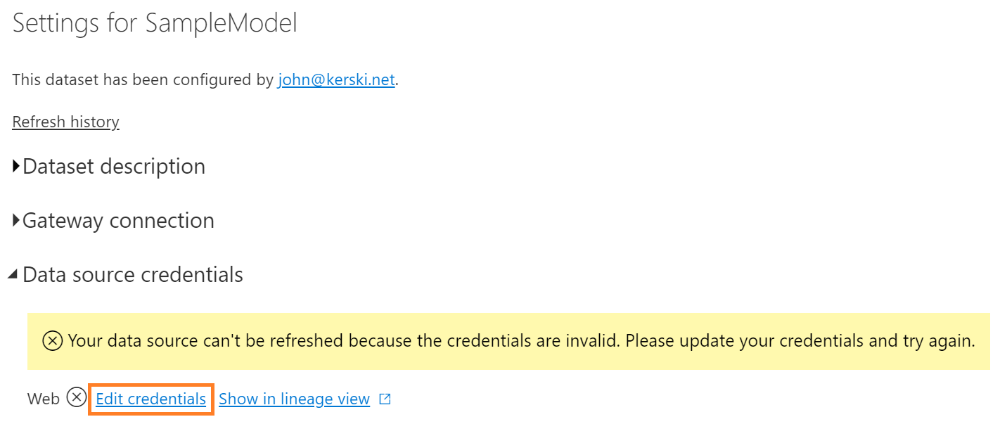

# "Bringing DataOps to Power BI" this branch serves to provides templates for applying DataOps principles with Power BI datasets

These instructions are a continuation from <a href="https://www.kerski.tech/bringing-dataops-to-power-bi-part25/" target="_blank">Part 25 of Bringing DataOps to Power BI</a>.  The steps below describe how to setup a DevOps project with a pipeline that tests and deploys a Power BI report.

> ***Important Note #1**: This guide is customized to Power BI for U.S. Commercial environment. If you are trying to set this up for another Microsoft cloud environment (like U.S. Gov Cloud), please check Microsoft's documentation for the appropriate URLs. They will be different from the U.S. Commercial environment.*

> ***Important Note #2**: This guide uses scripts that I built and tested on environments I have access to. Please review all scripts if you plan for production use, as you are ultimately response for the code that runs in your environment.*

## Table of Contents

1. [Prerequisites](#Prerequisites)
1. [Installation Steps](#Installation-Steps)
1. [Priming the Pipeline](#Priming-the-Pipeline)
1. Version Control
    1. [Cloning the Project](./documentation/clone-project.md)
    1. [Tracking Changes](./documentation/tracking-changes.md)
1. Testing
    1. [Generating Tests](./documentation/generate-tests.md)
    1. [Running Tests](./documentation/run-tests.md)

## Prerequisites

### Power BI
-   Power BI Premium Per User license assigned to a service account. If you do not have a Premium Per User license, use the "Buy Now" feature on <a href="https://docs.microsoft.com/en-us/power-bi/admin/service-premium-per-user-faq" target="_blank">Microsoft's site</a> or if you don't have access to do that, please contact your administrator (be nice!).

### Desktop

-  <a href="https://docs.microsoft.com/en-us/cli/azure/install-azure-cli" target="_blank">Azure CLI</a> installed.

-  <a href="https://docs.microsoft.com/en-us/powershell/scripting/install/installing-powershell-on-windows?view=powershell-7.2" target="_blank">PowerShell Core</a> and <a href="https://learn.microsoft.com/en-us/powershell/module/microsoft.powershell.core/about/about_windows_powershell_5.1?view=powershell-5.1" target="_blank">PowerShell for .NET Framework (5.1)</a>.  PowerShell for .NET Framework is used for testing given that the SqlServer Module for PowerShell does not work for .NET Core (as of Jan. 2023).

-   <a href="https://desktop.github.com/" target="_blank">GitHub desktop</a> installed.

-   Power BI Desktop installed on device executing these steps. *Please do not include from the Microsoft store as this does not make it compatible with pbi-tools (as of Jan. 2023)*

### Azure DevOps

-  Signed up for <a href="https://docs.microsoft.com/en-us/azure/devops/user-guide/sign-up-invite-teammates?view=azure-devops" target="_blank">Azure DevOps</a>.

- For Azure DevOps you must be a member of the Project Collection Administrators group, the Organization Owner, or have the Create new projects permission set to Allow. 

### pbi-tools

- Please install pbi-tools.  Installation instructions are <a href="https://pbi.tools/tutorials/getting-started-cli.html" target="_blank">at this link.</a>

- Please note that Power BI desktop must NOT be installed from the Microsoft Store, and you will need to make sure pbi-tools is added to your environment PATH variable.

## Installation Steps

### Create Power BI Workspaces and Create Azure DevOps project
1. Open PowerShell Version 7 and enter the following script:
    > Invoke-WebRequest -Uri "https://raw.githubusercontent.com/kerski/pbi-dataops-template/part25/SetupScripts/PremiumPerUser/Setup-PPU.ps1" -OutFile "./Setup-PPU.ps1"

    ***Important Note #3**: You may need to run Unblock-File ./Setup-PPU.ps1 depending on your PowerShell execution policies.*
    
1. This will download the setup scripts to the current folder.  Run ".\Setup-PPU.ps1" in PowerShell.

1. During the install process you will be prompted to enter the following information:

    - The name of the workspaces you wish to create in the Power BI Service.
    - The name of the development workspace you wish to create in the Power BI Service.
    - The name (UPN/email) of the Service account you created in the Prerequisites section.
    - The password for the (UPN/email).
    - The name of the project you wish to create in Azure DevOps.

    

1. During the course of the install you will be prompted to enter your Microsoft 365 credentials. Depending on your environment you may have a browser tab appear to sign-in. After signing in you can return to the PowerShell window. In addition, if you don't have the Power BI Management Shell or Azure DevOps CLI package installed, you will be asked to install.  Please affirm you wish to install those packages if prompted.

    

1. If the script runs successfully you will be presented with a message similar in the image below. 

    

## Priming the Pipeline

As stated in <a href="https://www.kerski.tech/bringing-dataops-to-power-bi-part5/" target="_blank">Part 5 of Bringing DataOps to Power BI</a> the data source credentials have to be manually set in order for the pipeline to be automated.  This is based on Power BI's architecture as of August 2022.  Please take the following steps to setup the credentials for the SampleModel.pbix file found within this project.

1. Navigate to <a href="https://app.powerbi.com" target="_blank">app.powerbi.com</a> and go the workspace you named in step 5 on the [Installation Steps](#InstallationSteps). Find the dataset and select the 'Settings' option (example outlined in orange in the image below).

    

1. Expand the 'Data source credentials' section and select 'Edit Credentials' link (outlined in orange in the image below).
    

1. Select the Authentication method as "Anonymous" and Privacy level to "None" and then press the "Sign in" button.

    

## Next Steps

Now that installation steps are completed, please review and share the instructions for [Cloning the Project](./documentation/clone-project.md)

