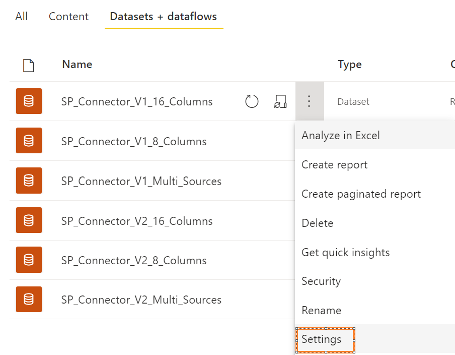
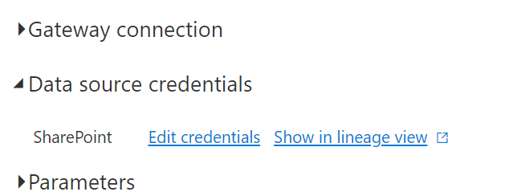
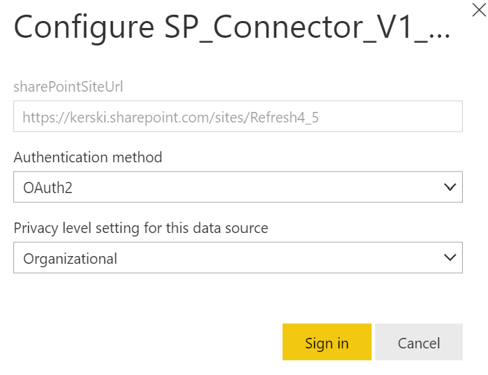

# Part 17 of "Bringing DataOps to Power BI" this branch serves to provides templates for applying DataOps principles.

These instructions are a continuation from <a href="https://www.kerski.tech/bringing-dataops-to-power-bi-part17/" target="_blank">Part 17 of Bringing DataOps to Power BI</a>.  The steps below describe how to setup a test of the Power BI connectors to SharePoint. 

> ***Important Note #1**: This guide is customized to Power BI for U.S. Commercial environment. If you are trying to set this up for another Microsoft cloud environment (like U.S. Gov Cloud), please check Microsoft's documentation for the appropriate URLs. They will be different from the U.S. Commercial environment.*

> ***Important Note #2**: This guide uses scripts that I built and tested on environments I have access to. Please review all scripts if you plan for production use, as you are ultimately response for the code that runs in your environment.*

## Table of Contents

1. [Prerequisites](#Prerequisites)
1. [Installation Steps](#Installation-Steps)
1. [Running the Pipeline](#Run-Pipeline)

## Prerequisites

### Power BI
-   Power BI Premium Per User license assigned to a service account. If you do not have a Premium Per User license, use the "Buy Now" feature on <a href="https://docs.microsoft.com/en-us/power-bi/admin/service-premium-per-user-faq" target="_blank">Microsoft's site</a> or if you don't have access to do that, please contact your administrator (be nice!).

### Desktop

-  <a href="https://docs.microsoft.com/en-us/powershell/scripting/install/installing-powershell-on-windows?view=powershell-7.2" target="_blank">PowerShell 7</a> installed.  If you are using Windows 10 or 11, this should be installed already. For the purposes of the instructions I'm going to use PowerShell ISE to run a PowerShell script. 

## Installation Steps

### Create Power BI Workspaces and Create Azure DevOps project
1. Open PowerShell Version 7 and enter the following script:
    > Invoke-WebRequest -Uri "https://raw.githubusercontent.com/kerski/pbi-dataops-template/part17/SetupScripts/Pbi/Part17/SetupPart17.ps1" -OutFile "./Setup-Part17.ps1"

1. This will download the setup scripts to the current folder.  Run ".\Setup-Part17.ps1" in PowerShell.

1. During the install process you will be prompted to enter the following information:

    - The name of the SharePoint site you wish to create to load the SharePoint lists for testing.
    - The name of the workspaces you wish to create in the Power BI Service for testing.

1. During the course of the install you will be prompted to enter your Microsoft 365 credentials. Depending on your environment you may have a browser tab appear to sign-in. After signing in you can return to the PowerShell window. In addition, if you don't have the Power BI Management Shell or SharePont PnP package installed, you will be asked to install.  Please affirm you wish to install those packages if prompted.

1. NOTE: The script that loads the SharePoint list data will take a while because it is loading 19,999 records to each of the two SharePoint sites.

1. If the script runs successfully you will be presented with a message similar in the image below. 

    TODO

## Setup Power BI Connections

As stated in <a href="https://www.kerski.tech/bringing-dataops-to-power-bi-part5/" target="_blank">Part 5 of Bringing DataOps to Power BI</a> the data source credentials have to be manually set in order for the pipeline to be automated.  This is based on Power BI's architecture as of April 2022.  Please take the following steps to setup the credentials for all the Power BI files found within this project.

1. Navigate to <a href="https://app.powerbi.com" target="_blank">app.powerbi.com</a> and go the workspace you named in the [Installation Steps](#InstallationSteps). Find the dataset and select the 'Settings' option (example outlined in orange in the image below).

    

1. Expand the 'Data source credentials' section and select 'Edit Credentials' link.

    

1. Select the Authentication method as "OAuth2" and Privacy level to "Organizational" and then press the "Sign in" button.

    

## Run the Refresh

1. For these instructions you have some choices:
    1. Run refreshes manually (lots of clicks)
    1. Schedule refreshes manually (lots of clicks, but maybe better?)
    1. Try using this Power Automate template. Follow <a href="https://powerautomate.microsoft.com/en-us/blog/import-export-bap-packages/">these instructions to import the flow</a>.  Note the easiest, and open to feedback on a more scripted way to do this.
2. I recommended run at least 25 refreshes and at varying times.

## Check the Results

1. Follow <a href="https://github.com/kerski/bringing-dataops-to-pbi/tree/main/part2-monitor-for-quality-and-performance">these instructions</a> to setup a local (not necessarily for Power BI service use according to Microsoft) Power BI report to validate the Report Refreshes.

## Turn off Refreshes

1. After you are done with testing don't forget to turn off any refreshes.