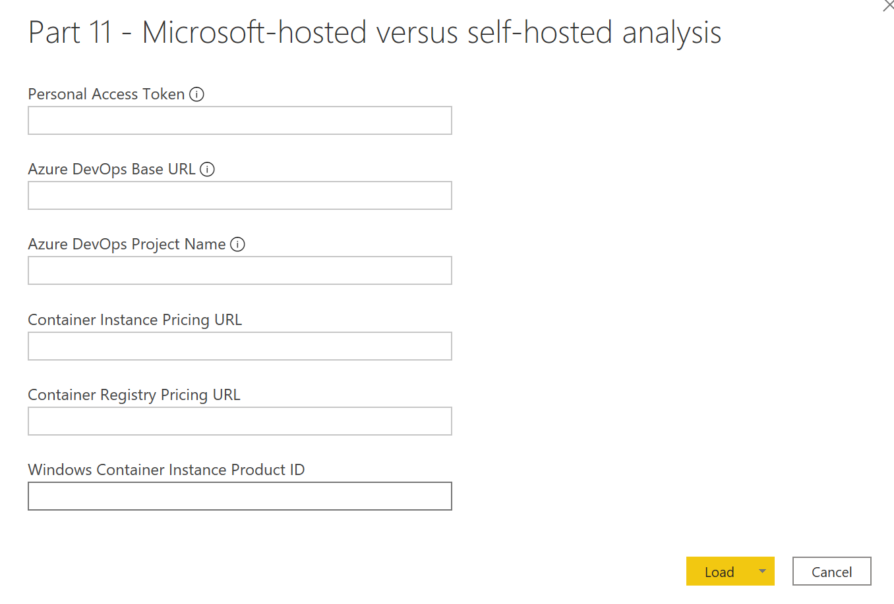
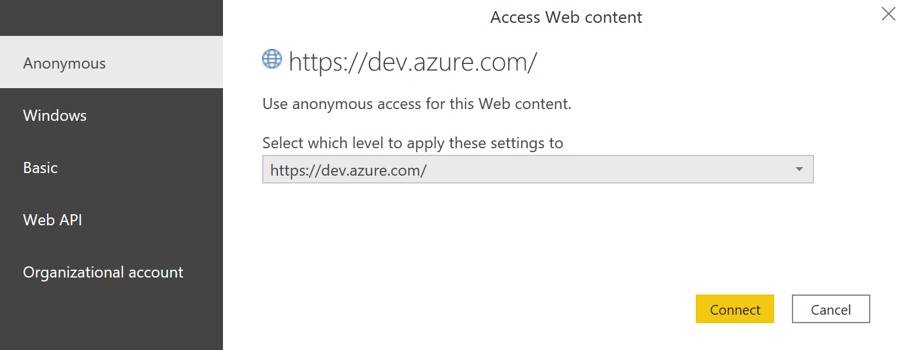
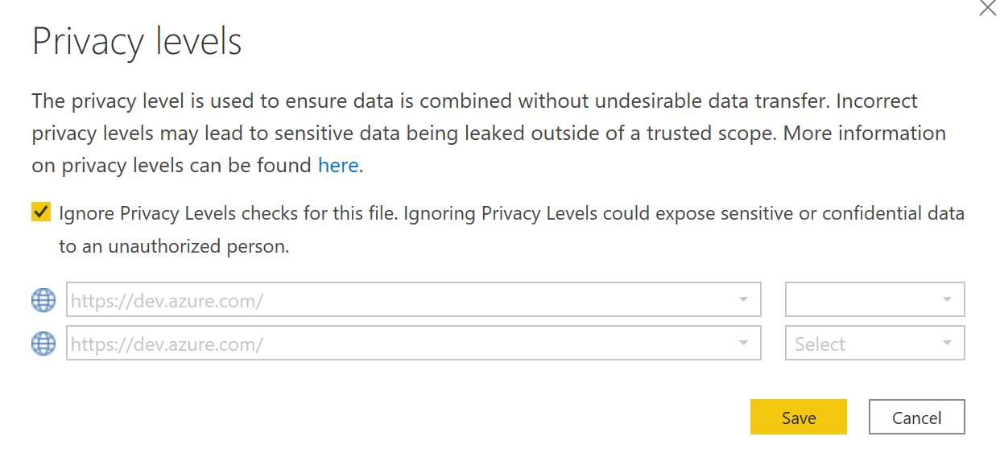
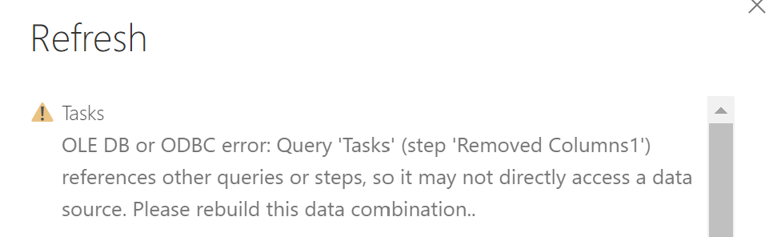

# Part 11 of "Bringing DataOps to Power BI" this branch serves to provides templates for applying DataOps principles.

These instructions are a continuation from <a href="https://www.kerski.tech/bringing-dataops-to-power-bi-part11/" target="_blank">Part 11 of Bringing DataOps to Power BI</a>.  The steps below describe how to setup the Power BI Template to analyze the performance of self-hosted agents and Microsoft-hosted agents.

> ***Important Note #1**: This guide is customized to Power BI for U.S. Commercial environment. If you are trying to set this up for another Microsoft cloud environment (like U.S. Gov Cloud), please check Microsoft's documentation for the appropriate URLs. They will be different from the U.S. Commercial environment.*

> ***Important Note #2**: This guide uses scripts that I built and tested on environments I have access to. Please review all scripts if you plan for production use, as you are ultimately response for the code that runs in your environment.*

## Table of Contents

1. [Prerequisites](#Prerequisites)
1. [Installation Steps](#Installation-Steps)

## Prerequisites

### Part 10 Setup

- The Power BI Template relies on data created in Azure DevOps during Part 10.  Please follow Part 10's instructions <a href="https://github.com/kerski/pbi-dataops-template/blob/part10/README.md">at this link</a>.

### Desktop

-  <a href="https://docs.microsoft.com/en-us/cli/azure/install-azure-cli" target="_blank">Azure CLI</a> installed.

### Azure DevOps

-  Signed up for <a href="https://docs.microsoft.com/en-us/azure/devops/user-guide/sign-up-invite-teammates?view=azure-devops" target="_blank">Azure DevOps</a>.

- For Azure DevOps you must be a member of the Project Collection Administrators group or the Organization Owner.

- A Personal Access Token with Full Access permissions. Instructions can be accessed at <a href="https://docs.microsoft.com/en-us/azure/devops/organizations/accounts/use-personal-access-tokens-to-authenticate?view=azure-devops&tabs=preview-page#create-a-pat">this link</a>. Be sure to copy the token because you will use it later.

## Installation Steps

### 3. Update PBI Monitoring PPU template

1. Download the template file <a href="" target="_blank">Part 11 - Microsoft-hosted versus self-hosted analysis</a> from GitHub.

2. Open "Part 11 - Microsoft-hosted versus self-hosted analysis.pbit". You will be prompted to enter the fields six parameters.

3.  Enter the following:

-   **Personal Access Token**: This was the project created during Part 10 ([Prerequisites](#Prerequisites))

-   **Azure DevOps Base URL**: This was the project created during Part 10 ([Prerequisites](#Prerequisites)). Example would be "https://dev.azure.com/yourorg"

-   **Azure DevOps Project Name**: This was the project created during Part 10 ([Prerequisites](#Prerequisites)). Example would be "{project}" in the URL "https://dev.azure.com/yourorg/{project}"

-   **Container Instance Pricing URL**: https://prices.azure.com/api/retail/prices?$filter=serviceFamily eq 'Containers' and serviceName eq 'Container Instances' 

-   **Container Registry Pricing URL**: https://prices.azure.com/api/retail/prices?$filter=serviceFamily eq 'Containers' and serviceName eq 'Container Registry'

-   **Windows Container Instance Product ID**: DZH318Z0BQV6

4. Press the "Load" button.

5. You may be prompted to login to https://dev.azure.com. Please choose use anonymous option since the Personal Access Token you entered in step 3 will be used for authentication.

6. You may also be prompted to update the privacy levels. Select the ignore Privacy levels text box and press the Save button.

7. It may take a few minutes to load the data, but if all steps and prerequisites are set correctly the report should load.

8. If you get an error as shown below. Close the error message and click the "Refresh Data" option in the file in order for the dataset to rebuild.

9. 