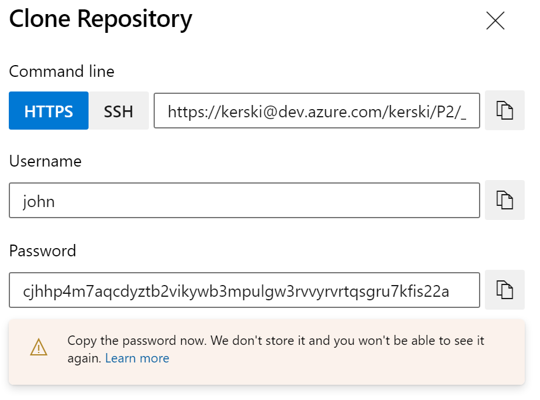
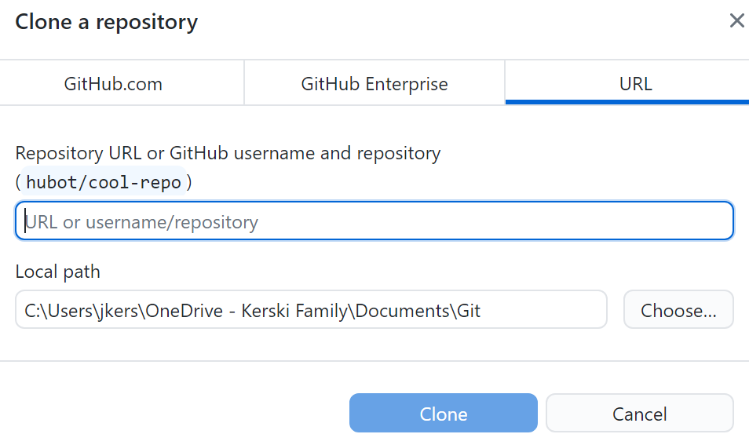
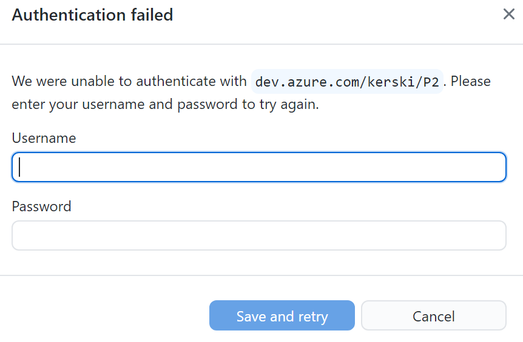

# Part 5 of "Bringing DataOps to Power BI" this branch serves to provides templates for applying DataOps principles.

These instructions are a continuation from <a href="https://www.kerski.tech/bringing-dataops-to-power-bi-part5/" target="_blank">Part 5 of Bringing DataOps to Power BI</a>.  The steps below describe how to setup a DevOps project with a pipeline that tests and deploys a Power BI report.

> ***Important Note #1**: This guide is customized to Power BI for U.S. Commercial environment. If you are trying to set this up for another Microsoft cloud environment (like U.S. Gov Cloud), please check Microsoft's documentation for the appropriate URLs. They will be different from the U.S. Commercial environment.*

> ***Important Note #2**: This guide uses scripts that I built and tested on environments I have access to. Please review all scripts if you plan for production use, as you are ultimately response for the code that runs in your environment.*

## Table of Contents

TODO

## Prerequisites

### Power BI
-   Power BI Premium Per User license assigned to a service account. If you do not have a Premium Per User license, use the "Buy Now" feature on <a href="https://docs.microsoft.com/en-us/power-bi/admin/service-premium-per-user-faq" target="_blank">Microsoft's site</a> or if you don't have access to do that, please contact your administrator (be nice!).

### Desktop

-  <a href="https://docs.microsoft.com/en-us/cli/azure/install-azure-cli">Azure CLI</a> installed.

-  <a href="https://docs.microsoft.com/en-us/powershell/scripting/install/installing-powershell?view=powershell-7.1">Powershell</a> installed.  If you are using > Windows 10/11, this should be installed already. For the purposes of the instructions I'm going to use PowerShell ISE to run a PowerShell script. 

-   <a href="https://desktop.github.com/">GitHub desktop</a> installed.

-   Power BI Desktop installed on device executing these steps.

### Azure DevOps

-  Signed up for <a href="https://docs.microsoft.com/en-us/azure/devops/user-guide/sign-up-invite-teammates?view=azure-devops" target="_blank">Azure DevOps</a>.

- For Azure DevOps you must be a member of the Project Collection Administrators group, the Organization Owner, or have the Create new projects permission set to Allow. 

## Installation Steps

### Create Power BI Workspaces and Create Azure DevOps project
1. Open PowerShell ISE and enter the followinging script:
    > Invoke-WebRequest -Uri "https://raw.githubusercontent.com/kerski/pbi-dataops-template/part5/SetupScripts/PremiumPerUser/Setup-PPU.ps1" -OutFile "./Setup-PPU.ps1"

1. Highlight the code and select "Run Selection" (outlined in orange in the image below) 

    

1. This will download the setup script to the current folder.  Open the file "Setup-PPU.ps1" in PowerShell ISE.

1. Highlight the code and select "Run Selection" (outlined in orange in the image below)

    

1. During the install process you will be prompted to enter the following information:

    - The name of the build workspace you wish to create in the Power BI Service.
    - The name of the development workspace you witsh to create in the Power BI Service.
    - The name (UPN/email) of the Service account you created in the Prerequisites section.
    - The password for the (UPN/email). ***Important Note**: This scripts assumes PowerShell Version 5.1, so this password WILL NOT be masked. Make sure to protect this password from someone snooping behind you.* 
    - The name of the project you wish to create in Azure DevOps.

    

1. During the coure of the install you will be prompted to enter your credentials. Depending on your environment you may have a browser tab appear to sign-in. After signing in you can return to the Powershell ISE window. In addition, if you don't have the Power BI Management Shell or Azure DevOps CLI package installed, you will be asked to install.  Please affirm you wish to install those packages if prompted.

    

1. If the script runs successfully you will be presented with a message similar in the image below.

## Running the Pipeline

With the installation step complete now you will need to follow these steps to work with project locally, make a change to a Power BI file, commit it to the repository in Azure DevOps and see the pipeline in action.

1. Copy the URL and navigate

1. Select clone the repository

    

1.  Copy the textbox under command line. I suggest copying to Notepad temporarily as you'll have two other text fields to copy.

 

1. Press the "Generate Git Credentials" button.

 

1. Copy the Username and Password to Notepad temporarily.

1. Open GitHub Desktop and select clone reposistory

 

 1. 

  

  1. TODO Fix image names

