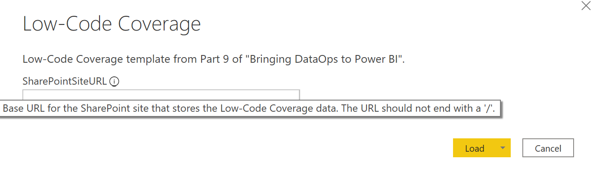
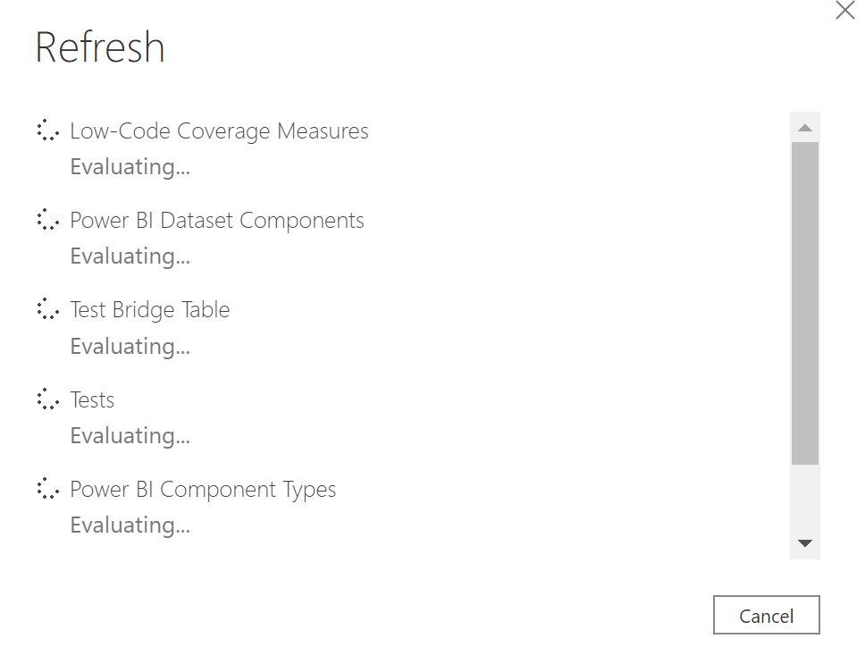

# Part 9 of "Bringing DataOps to Power BI" this branch serves to provides templates for applying DataOps principles.

These instructions are a continuation from <a href="https://www.kerski.tech/bringing-dataops-to-power-bi-part9/" target="_blank">Part 9 of Bringing DataOps to Power BI</a>.  The steps below describe how to setup the Low-Code Coverage Report.

> ***Important Note #1**: This guide is customized to Power BI for U.S. Commercial environment. If you are trying to set this up for another Microsoft cloud environment (like U.S. Gov Cloud), please check Microsoft's documentation for the appropriate URLs. They will be different from the U.S. Commercial environment.*

> ***Important Note #2**: This guide uses scripts that I built and tested on environments I have access to. Please review all scripts if you plan for production use, as you are ultimately response for the code that runs in your environment.*

## Table of Contents

1. [Prerequisites](#Prerequisites)
1. [Installation Steps](#Installation-Steps)

## Prerequisites

### Desktop

-  <a href="https://docs.microsoft.com/en-us/powershell/scripting/install/installing-powershell?view=powershell-5.1" target="_blank">PowerShell 5.1</a> installed.  If you are using Windows 10 or 11, this should be installed already. For the purposes of the instructions I'm going to use PowerShell ISE to run a PowerShell script. 

-   Power BI Desktop installed on device executing these steps.

## Installation Steps

### Follow the steps from Part 8
1. Since Part 9 is a continuation of Part 8, you'll need to setup the example that logs the Low-Code Coverage data to SharePoint Online.  Please see these instructions: <a href="https://github.com/kerski/pbi-dataops-template/blob/part8/README.md" target="_blank">Part 8 instructions</a>

### Setup the Power BI Template

1. Open PowerShell ISE and enter the following script:
    > Invoke-WebRequest -Uri "https://raw.githubusercontent.com/kerski/pbi-dataops-template/part9/LowCodeCoverage/Low-CodeCoverage.pbit" -OutFile "Low-CodeCoverage.pbit"

1. Open "Low-CodeCoverage.pbit". You will be prompted to enter the SharePoint Online site URL created during Part 8 of the installation.  Enter the URL and press the "Load" button.

    

1. It may take a few minutes to load the data, but if all steps and permissions are set correctly the report should load.

    

1. Please be sure to save the file in an appropriate location when finished.