# Cloning a Project
This serves as a guide for using Git to update .pbix files and sync back to the Git repository in Azure DevOps using Visual Studio Code.

# Table of Contents

1. [Getting Started](#getting-started)
1. [Prerequisites](#prerequisites)
1. [Clone Project](#clone-project)
1. [Updating Power BI Files](#updating-power-bi-files)
1. [Syncing your changes with Azure DevOps Server](#syncing-your-changes-with-azure-devops-server)
1. [Verify Pipeline Completes Successfully](#verify-your-updates-are-in-the-development-workspace)

# Getting Started
##	Prerequisites

- Complete [installation instructions](README.md)

### Desktop
- If you're not familiar with Git, please see Lessons 1-2 on <a href="https://www.simplilearn.com/tutorials/git-tutorial/git-tutorial-for-beginner" target="_blank">this site</a>.
- Download and install <a href="https://code.visualstudio.com/">Visual Studio Code</a>.
- Power BI Desktop.
- Download and install <a href="https://daxstudio.org/downloads/" target="_blank">DAX Studio</a>.

### Azure DevOps
-  Signed up for <a href="https://docs.microsoft.com/en-us/azure/devops/user-guide/sign-up-invite-teammates?view=azure-devops" target="_blank">Azure DevOps</a>.

## Clone Project
Azure DevOps is a product that can host a repository (a.k.a. repo).  This repo is the central area where the Power BI files and other files related to this project are stored.  In order to make updates to these files you need to "clone" the project to your local machine. This operates similarly to how OneDrive files in the cloud appear in a folder on your laptop.  Please follow the instructions below to clone the project.

1. Navigate to the project created during the installation steps located on the Azure DevOps site. Click on the Repos section and select the Clone button (outlined in orange in the image below).  

2. Click the "Clone in VS Code" button.

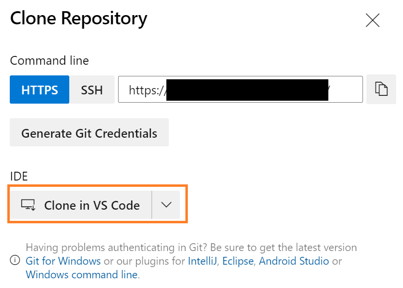

3. You may be prompted by a couple of pop-ups.  Please accept.

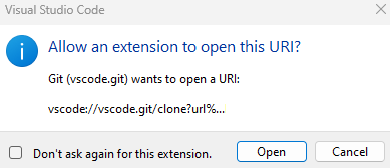

4. Next you will be prompted to select where you want to clone the repository on your computer.  Please select an appropriate location.  One suggestion would be to have a folder called "Git" and then place this project there.

5. If all goes well, Visual Studio Code will open and you will be prompted to open the project.  I suggest clicking the "Open in New Window" button.

6. From Visual Studio Code click the terminal menu option and select "New Terminal".

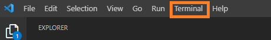

7. From the terminal run: "Get-ChildItem -Path '.' -Recurse | Unblock-File"

This will allow us to run the Powershell scripts locally

8. From the terminal run: "git checkout part23". This will move you to the part23 branch where you should be performing your updates.  You can verify that you are in the right branch by looking at the bottom right of Visual Studio.  If you see "part23", you've successfully completed this step.

9. Your project is now setup for developing.  Sometimes Visual Studio code will ask you if you want to call Git Fetch on your behalf.  Choose yes and this will provide updates from the repository in Azure DevOps.

# Updating Power BI Files

1. The folder structure for

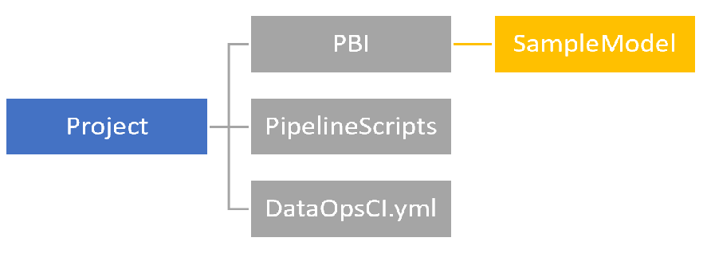

- PBI – Within its own subfolder, this is where you would store a .pbix file and its tests (.dax and .msdax). In the image above, SampleModel.pbix file and 3 test files would be stored in the SampleModel subfolder. <b>There should be one subfolder per .pbix file.  Please do not put more than one .pbix file in the same subfolder.</b>
- PipelineScripts – These files inform how the orchestration happens.
- DataOpsCI.yml – The YAML file that guides the orchestration and contains important environmental variables.

2. To edit a Power BI file you can right-click on the Explorer pane and select Reveal in explorer.

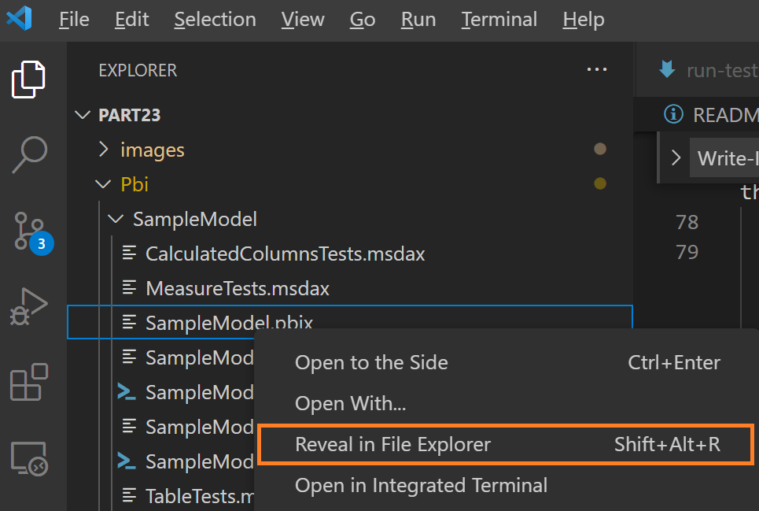

3. Within File Explorer (for Windows) navigate to the project folder that was cloned and within that folder navigate to Pbi->SampleModel->SampleModel.pbix and open the pbix file.

4. Navigate to the "Number of Characters" metric (outlined in orange in the image below) and remove "+ 0" from the measure (outlined in purple in the image below).  Then save the changes.  This demonstrates a change made to the Power BI file by a developer.

5. When you have completed editing the Power BI file, save the file using the save button within Power BI.

# Syncing your changes with Azure DevOps Server
As soon as you save the Power BI file, you can return to Visual Studio Code and within the Source Control pane see that the file has been modified. Git tracks every change to a file within this project.

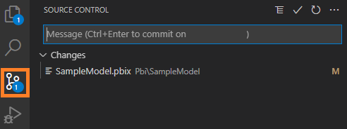

To sync the changes back to the Azure DevOps Server, please follow these steps:

6. Within the Source Control pane, add a short description of your changes. Then hit the check mark.

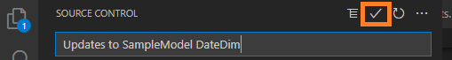

7. Then press the "Sync Changes" button.  Depending on the network bandwidth, this can take a few seconds to complete.

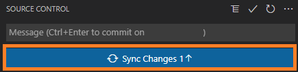

# Automated Pipeline

This project has an Azure DevOps Pipeline enabled to trigger any time the development branch of the repository in Azure DevOps is updated.  Therefore, if you complete [steps to sync to Azure DevOps](#syncing-your-changes-with-azure-devops-server) then this DevOps Pipeline will kick off as follows:

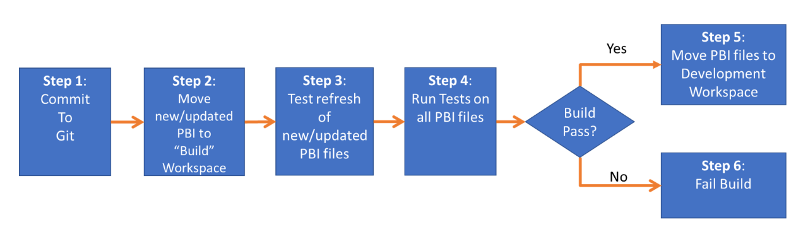

1. You've complete the [steps to sync to Azure DevOps](#syncing-your-changes-with-azure-devops-server).

2. The automated scripts in the PipelineScripts folder identifies any new or changed .pbix files and publishes to the Build workspace using the premium per user account. 

3. Any new or changed .pbix files are refreshed (if they are a dataset). **NOTE: The first time a new file is placed in the Build workspace, the refresh will fail. You have to “prime” the pipeline and set the data source credentials manually.  Please talk with the lead developer about setting those credentials**. As of August 2022, setting data source credentials (like OAuth) is not fully automated by Microsoft.

4. Any tests sitting in the same folder as each .pbix file are ran against the .pbix file in the Build Workspace using XMLA (which is why an app service principal is needed). Please note that regardless of if the .pbix file is new, changed, or unchanged, tests are executed. Failed tests are logged to Azure DevOps and the build will fail.

5. If a .pbix file has all the tests pass, then the .pbix file is moved to the Development workspace.

6. If step 4 for a .pbix file has resulted with a failed test, then the build will fail and the Development workspace will not be updated

# Verify your updates are in the Development workspace

1. Once you complete your updates, navigate back to Azure DevOps and you should see the pipeline in progress.  This is typically donated by the a blue clock icon. Note the description you entered in [steps to sync to Azure DevOps](#syncing-your-changes-with-azure-devops-server) will appear.  Press the pipeline link (outlined in orange in the image below).

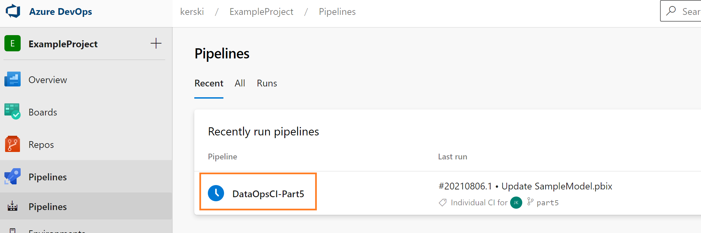

2. This page will show you the latest status of the pipeline.  The example image below shows the commit you pushed to Azure DevOps and that the pipeline is in progress.

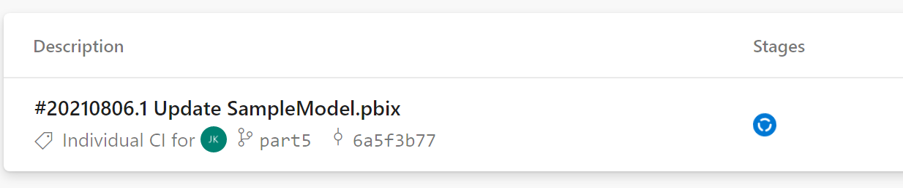

3. Once the pipeline completes you should get a green checkmark icon.  You may also receive an email stating the pipeline successfully completed.

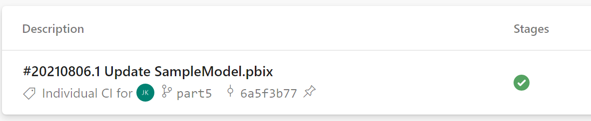

5. If the pipeline successfully completes you will see your changes reflected in the Development workspace.

## Failed Build Example
If a test case fails in the pipeline you will see a red x icon appear in the Azure DevOps Pipeline. 

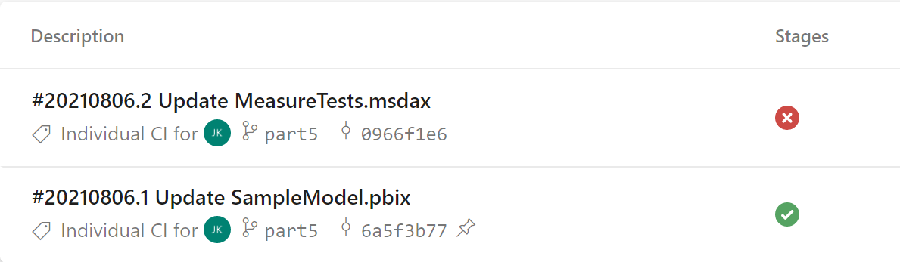

If you click on the failed entry (outlined in orange in the image below) you will be presented with a screen providing details of the failed tests.

For example, in the image below you can see an example of the failed test.

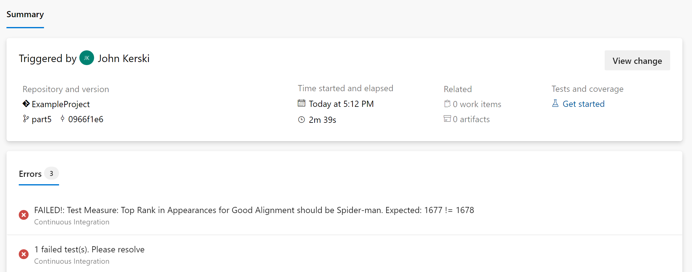

## Running tests

Please see [instructions for running tests](./run-tests.md)