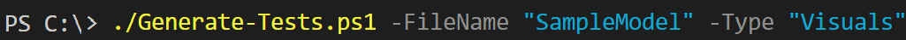
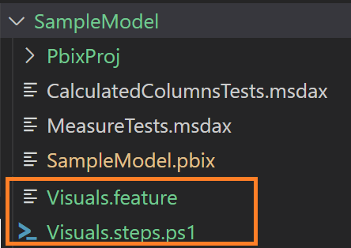

# Generating Tests
These instructions define how to generate tests for a .pbix file in the project.

## Table of Contents

1. [Generating a Test](#generating-a-test)
    - [Visual Test Template](#visual-tests)

## Generating a Test

Generating tests are based on the Behavior Drive Development (BDD) concept. Pester Version 4's implementation of the Gherkin language
facilitates BDD testing by defining tests through written narratives and acceptance criteria.

Tests are based on two files:
- .feature file - The type of tests written in plain language.
- .steps.ps1 - The implementation of the tests.

The following sections below provide instructions on generating tests.

### Visual Test Template

As of January 2023, this project has the ability to generate a set of tests for evaluating the reports, tabs, and visuals in a Power BI report.

To generate a template, here are the steps:

1. Make sure you've run an extraction using pbi-tools for the specific Power BI report.  Please see these instructions for <a href="" target="_blank">running an extraction you pbi-tools</a>.

2. Then within Visual Studio Code click the terminal menu option and select "New Terminal".

3. Then from the terminal enter the command ./Generate-Tests.ps1 -Filename {PBIX} -Type "Visuals" where {PBIX} is replaced with the name of the Power BI file you wish to generate test cases for visuals.

4. If the command runs successfully, then two files will appear (example outlined in orange below) in the project's sub-folder.

#### Visual Test Contents

1. Within the Visual.feature file are several tests that are described in the <a href="./run-tests.md#visual-tests-for-reports" target="_blank">running tests</a> section; however, there are some important things to point out:

- You can disable and/or skip a test by putting a hash tag ('#') preceding the test.

- You can disable running a whole scenario or scenario outline by putting a hash tag ('#') preceding the appropriate scenario or scenario outline.