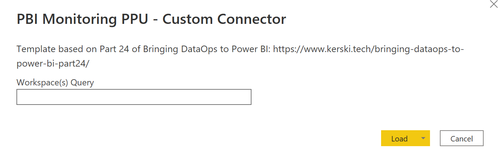
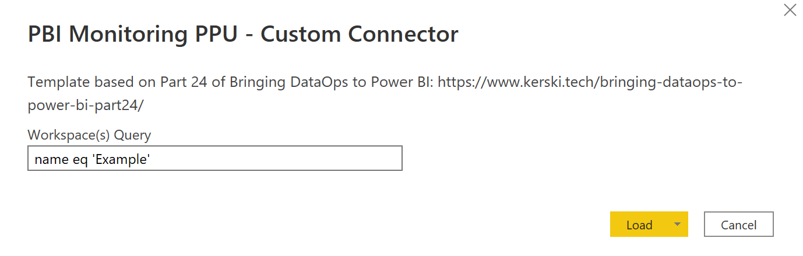
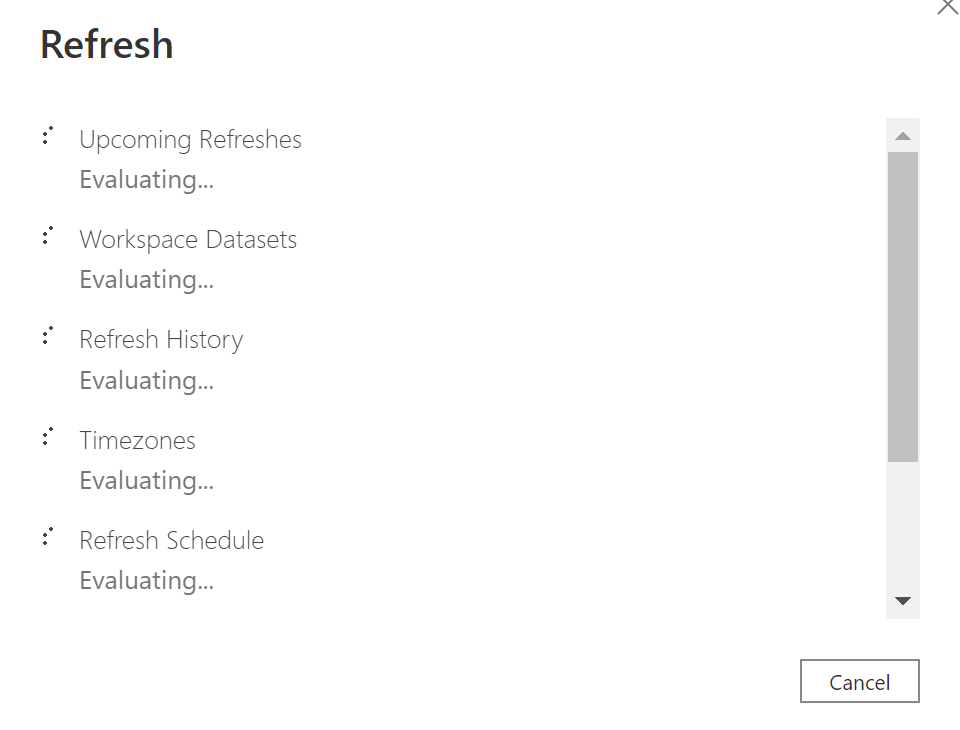
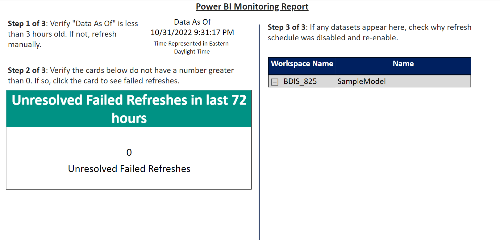

# Monitor Refreshes
This serves as a guide for setting up the [Power BI Monitoring report template](../SetupScripts/PremiumPerUser/PBI%20Templates/PBI%20Monitoring%20PPU%20-%20Custom%20Connector.pbit).

# Table of Contents

1. [Getting Started](#getting-started)
1. [Prerequisites](#prerequisites)
1. [Installation](#installation)

# Getting Started
##	Prerequisites

- Complete the installation instructions for the custom connector depending on the location of your Power BI service:
    -  [Power BI Commericial](https://github.com/kerski/powerquery-connector-pbi-rest-api-commercial#desktop)
    -  [Power BI Community Cloud](https://github.com/kerski/powerquery-connector-pbi-rest-api-gcc#desktop)

### Installation
1. Download the [Power BI Monitoring report template](../SetupScripts/PremiumPerUser/PBI%20Templates/PBI%20Monitoring%20PPU%20-%20Custom%20Connector.pbit) to your local machine.

2. Open the .pbit file and you will be prompted to enter text into the "Workspace(s) Query".

3. Enter the query for the specific workspaces you wish to monitor.  For example, if you want to monitor a workspace named "Example" then you would enter: <i>name eq 'Example'</i>.  If you want to monitor two workspaces named "Thing 1" and "Thing 2" then you would enter: <i>name eq 'Thing 1' or name eq 'Thing 2'</i>

4. Press the Load button and the refresh of the dataset will begin.

5. It may take a few minutes to load the data, but if all steps and permissions are set correctly the report should load.

