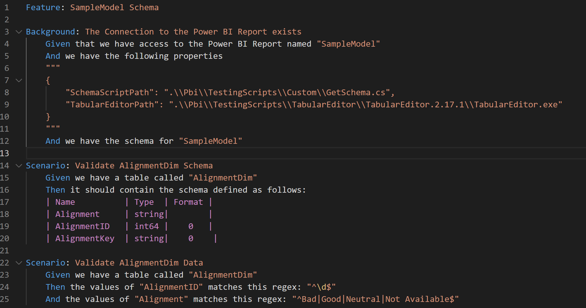
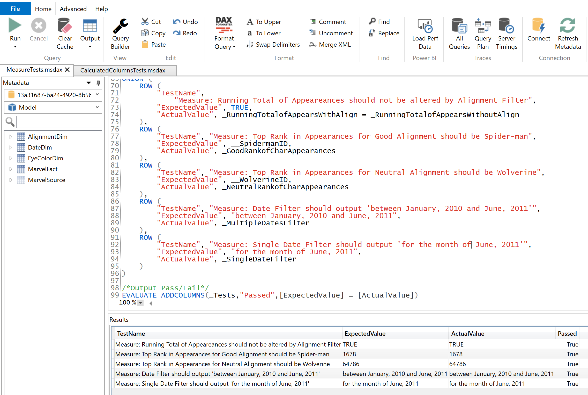
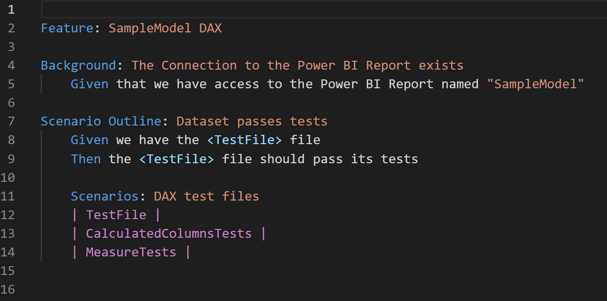
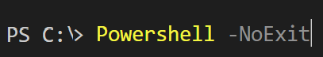
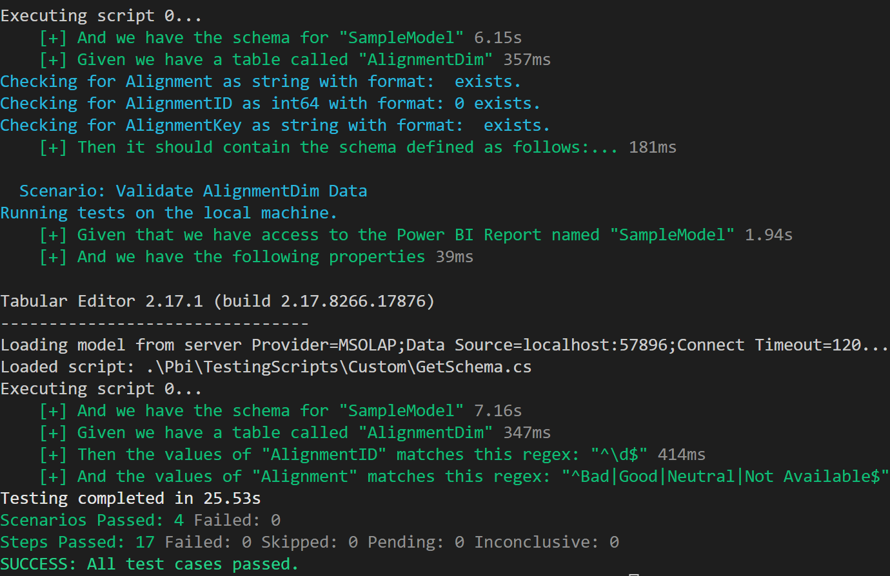
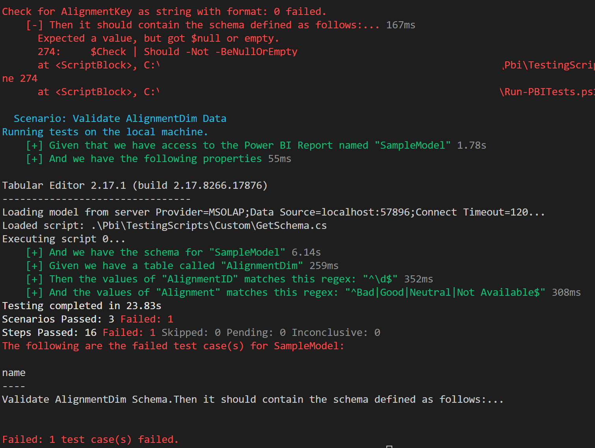

# Building and Running Tests
These instructions define how to run tests locally and the taxonomy of the tests.

## Table of Contents

1. [Testing Structure](#getting-started)
    - [.feature file](#feature-file)
        -[SampleModelSchema.feature](#samplemodelschemafeature)
        -[SampleModelDAX.feature](#samplemodeldaxfeature)
    - [.steps.ps1 file](#stepsps1-file)
        - [Background Tests](#background-tests)
        - [Schema Tests](#schema-tests)
        - [Regular Expression Tests](#regex-tests)
        - [DAX Tests](#dax-tests)

2. [Running Tests](#running-tests)

## The Testing Structure

Building and running tests are based on the Behavior Drive Development
(BDD) concept. Pester Version 4's implementation of the Gherkin language
facilitates BDD testing by defining tests through written narratives and
acceptance criteria.

Building tests are based on two files:

### .feature file

Within this project there are two sample .feature files:

#### SampleModelSchema.feature

This feature file shows how you can test the schema and content of the
Power BI dataset. The following is an example implementation:

### .feature file

Within this project there are two sample .feature files:

#### SampleModelSchema.feature

This feature file shows how you can test the schema and content of the Power BI dataset.  The following is an example implementation: 

Each sentence executes a test, which for the example above does the
following:

-   Line 1: Defines the type of test you are performing.
-   Lines 2-12: The Background section verifies the Power BI report
    exists, you have access to the files (in this case the wonderful
    Tabular Editor) to get the schema and verify you can retrieve it.
-   Lines 14-20: This Scenario is a set of steps to verify the
    'AlignmentDim' table exists and the schema defined is correct.
-   Lines 22-25: This Scenario is a set of steps that verifies the
    'AlignmentDim' table has certain columns that match the regular
    expressions defined.

#### SampleModelDAX.feature

This feature file shows how you can test a Power BI dataset using DAX. All
tests should result in an output that is consistent so that the
automated tests can verify the tests pass. Fortunately, with DAX, we can
create that schema. The example below provides the output of a set of
test cases and follows a simple format:

<ol type="a">
<li>Test Name- Description of the test prefixed by MEASURE,
        CALCULATED COLUMN, or TABLE to indicate what part of Power BI
        model is being tested.</li>
<li>Expected Value - What the test should result in. This should be
        a hardcoded value or function evaluated to a Boolean.</li>
<li>Actual Value - The result of the test under the current
        dataset.</li>
<li>Test Passed - True if the expected value matches the actual
        value. Otherwise, the result is false.</li>
</ol>

By leveraging a consistent schema to build tests using DAX, we can
automate the testing of multiple DAX files. In this template, we have 3
files (CalculatedColumnsTests, MeasureTests, and TableTests). Therefore,
the feature file to run multiple DAX test files is shown in the example
below.

Each sentence executes a test, which for the example above does the
following:

-   Line 1: Defines the type of test you are performing.
-   Lines 4-5: Verifies that Power BI reports exists.
-   Lines 7-9: Using the Scenario Outline we can create a loop to run
    each DAX test file.
-   Lines 11-14: With the Scenario Outline defined we can just add the
    name of the DAX file to the table containing one column called
    "TestFile". Then each file will be run (DAX query) against the Power
    BI dataset and the test will verify the expected values and actual
    values match.

### .steps.ps1 file

Each sentence in the feature file is backed by a ".steps.ps1" with the
same name as the feature file.

Since we want to take advantage of the same PowerShell code to run
similar schema and DAX tests, all ".steps.ps1" files reference the file
"Test-Support.steps.ps1".

The Test-Support.steps.ps1 file supports the following test cases:

#### Background Tests

##### Given 'that we have access to the Power BI Report named "{PBIFile}"'
Verifies the parameter {PBIFile} exists as a .pbix file within a
subfolder under the /Pbi folder.

#### Schema Tests

##### And "we have the following properties"
Accepts a json file that lists the location of Tabular Editor and the
GetSchema.cs file. This merely checks to see if those files exist so we
can conduct further tests.

##### And "we have the schema for {TableName}"
Accepts the {TableName} parameter and uses TabularEditor and the
GetSchema.cs file to pull the schema information for the table. If the
test case can get this information, it passes.

##### Then "it should {Contain or Match} the schema defined as follows:"
After the [prior schema test](#and-we-have-the-schema-for-tablename) this test accepts a table of information with the columns Name, Type, and Format such as:

	| Name          | Type  | Format |
	| Alignment     | string|        |

- Name: This is the name of the column.
- Type: This is the type of the column.
- Format: This is the format of the column.  You can leave this blank if format does not need to be tested.

This test accepts a parameter {Contain or Match}. If the parameter
entered is 'Contain' then this test will make sure each column exists
and matches the type and format. If the parameter entered is 'Match'
then this test will make sure the table has all the columns defined in
the test, that each column exists, and that each column matches the type
and format. The 'Match' value is strict and makes sure no new columns
exist in the dataset compared to the defined table in the feature file.

#### Regex Tests

##### Given 'we have a table called "{TableName}"'
Accepts the {TableName} parameter and makes sure table exists in the
dataset.

##### And 'the values of "{ColumnName}" matches this regex: "{Regex}"'
After the prior [table test](#given-we-have-a-table-called-tablename), this function accepts the {ColumnName} parameter and {Regex} parameter.  This verifies that the column in the table passes the regular expression.  The Regular Expression format follows the [.Net Regular Expressions format](https://learn.microsoft.com/en-us/dotnet/standard/base-types/regular-expressions). 

#### DAX Tests 

##### Given 'we have the {TestFile} file'

Verifies the parameter {TestFile} exists as a .msdax or .dax file within
the subfolder defined [by the PBIFile in the Background
tests.](#given-that-we-have-access-to-the-power-bi-report-named-pbifile)

##### Then {TestFile} file should pass its tests'
This queries the dataset defined [by the PBIFile in the Background
tests](#given-that-we-have-access-to-the-power-bi-report-named-pbifile)
using the DAX file defined by the parameter {TestFile}. If the query
returns an [acceptable schema](#samplemodeldaxfeature) and all the
expected values equal the actual values in the query results, the test
will pass.

## Running Tests

There are a few challenges when running the same tests both on your
local machine or against the Power BI Service (via a Continuous
Integration pipeline):

<b>Are we running these tests locally?</b> 

When running tests locally we need to connect to the Power BI dataset differently
    than when the Power BI dataset is in the service. If local, Power BI
    creates a network port to connect to via the localhost. In the
    service, the connection requires an XMLA connection with a different
    syntax.

<b>Which Power BI files are opened locally?</b>
When running
    tests locally we need to find which network port corresponds to each
    Power BI file that may be opened. We also need to make sure we run
    tests for only the opened Power BI files. 

To overcome these challenges, this project has a script called "Run-PBITests.ps1" that exists at the root of the project.

This script allows you to run the tests you created for each Power BI file that is open.  Here are the steps:

1. Within Visual Studio Code, open your project folder.

2. Then within Visual Studio Code click the terminal menu option and select "New Terminal".

3. From the terminal enter the command "Powershell -NoExit"

This commands makes sure we are running classic PowerShell and not PowerShell Core.  The command <a href="https://learn.microsoft.com/en-us/powershell/module/sqlserver/invoke-ascmd?view=sqlserver-ps" target="_blank">Invoke-AsCmd</a> has not been ported to work with PowerShell Core (as of August 2022) by Microsoft.  

4. Then from the terminal enter the command "./Run-PBITests.ps1"

5. If the test cases pass, then you will see in the terminal a confirmation of success with a message "SUCCESS: All test cases passed."

6. If a test fails, then you will see in the terminal which test cases failed (see example).

